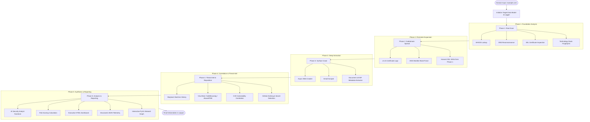

# VENOM — Technical Documentation & Framework Reference

> **Tagline:** *One domain in. Everything out.*  
> **Version:** `1.0.0`  
> **Classification:** Automated Passive OSINT & Attack Surface Reconnaissance Framework  
> **License:** [MIT License](file:///home/apathy/Projects/Venom/LICENSE)

---

## Table of Contents

1. [Executive Summary & Project Purpose](#1-executive-summary--project-purpose)
2. [Why VENOM? (The Problem Space)](#2-why-venom-the-problem-space)
3. [Intended Use Cases & Target Audience](#3-intended-use-cases--target-audience)
   - [External Attack Surface Management (EASM)](#external-attack-surface-management-easm)
   - [Bug Bounty Hunting & Target Triage](#bug-bounty-hunting--target-triage)
   - [Pre-Engagement Penetration Testing Recon](#pre-engagement-penetration-testing-recon)
   - [Corporate Brand Protection & Threat Intelligence](#corporate-brand-protection--threat-intelligence)
   - [Educational Security Research](#educational-security-research)
4. [System Architecture & Data Flow](#4-system-architecture--data-flow)
   - [Architecture Diagram](#architecture-diagram)
   - [Core Orchestration Engine](#core-orchestration-engine)
   - [Unified Target Data Model](#unified-target-data-model)
   - [Asynchronous Execution Model](#asynchronous-execution-model)
5. [In-Depth Feature & Module Breakdown](#5-in-depth-feature--module-breakdown)
   - [Phase 1: Root Scan & Foundation Recon](#phase-1-root-scan--foundation-recon)
   - [Phase 2: Subdomain Spread & Perimeter Expansion](#phase-2-subdomain-spread--perimeter-expansion)
   - [Phase 3: Deep Surface Crawl & Asset Extraction](#phase-3-deep-surface-crawl--asset-extraction)
   - [Phase 4: Threat Intelligence & Vulnerability Correlation](#phase-4-threat-intelligence--vulnerability-correlation)
   - [Phase 5: Cognitive Analysis & Report Generation](#phase-5-cognitive-analysis--report-generation)
6. [Quantitative Risk Scoring System](#6-quantitative-risk-scoring-system)
   - [Risk Weights & Scoring Rules](#risk-weights--scoring-rules)
   - [Severity Bands & Categorization](#severity-bands--categorization)
7. [Operational Guide & CLI Reference](#7-operational-guide--cli-reference)
   - [Installation & Environment Setup](#installation--environment-setup)
   - [Configuration Options (`config.yaml`)](#configuration-options-configyaml)
   - [CLI Parameters & Flag Syntax](#cli-parameters--flag-syntax)
   - [Sample Execution Scenarios](#sample-execution-scenarios)
8. [Deliverables & Report Artifacts](#8-deliverables--report-artifacts)
   - [Interactive HTML Executive Dashboard](#interactive-html-executive-dashboard)
   - [Dynamic PyVis / NetworkX Visual Graph](#dynamic-pyvis--networkx-visual-graph)
   - [Normalized JSON Output](#normalized-json-output)
9. [Competitive Landscape & Comparison](#9-competitive-landscape--comparison)
10. [Ethical Boundaries & Legal Compliance](#10-ethical-boundaries--legal-compliance)

---

## 1. Executive Summary & Project Purpose

**VENOM** is an open-source, automated Open Source Intelligence (OSINT) and external attack surface reconnaissance framework. Operating strictly on passive data-gathering principles, VENOM accepts a single target domain and systematically fans out across multiple reconnaissance vectors—uncovering infrastructure footprints, public DNS hierarchies, SSL/TLS configurations, web technologies, exposed files, historical archives, community threat reputation, known software vulnerabilities (CVEs), and leaked source code secrets.

Unlike fragmented single-purpose utilities that require manual pipelining (such as running `whois`, chaining `sublist3r`, running `wappalyzer`, and manually checking VirusTotal), VENOM consolidates the entire intelligence lifecycle into a synchronized pipeline managed by an asynchronous execution engine.

VENOM bridges the gap between **raw data collection** and **security intelligence** through:
- Automated multi-layered subdomain expansion (Certificate Transparency, DNS brute-forcing, and SAN harvesting).
- Live correlation of detected web technologies against known CVE advisories.
- Dorking engines that uncover leaked credentials, private tokens, and configuration artifacts on public repositories.
- An integrated AI Security Analyst engine that synthesizes raw telemetry into executive summaries, technical narratives, and prioritized remediation steps without requiring paid cloud APIs.
- Multi-dimensional deliverables: JSON telemetry, standalone HTML executive dashboards, and interactive topological network graphs.

---

## 2. Why VENOM? (The Problem Space)

Security analysts, bug bounty hunters, and IT administrators typically confront three major friction points during the initial reconnaissance phase:

```
┌────────────────────────────────────────────────────────────────────────┐
│                        TRADITIONAL RECON PAIN                          │
├───────────────────────┬────────────────────────┬───────────────────────┤
│    Tool Sprawl        │     Context Gap        │    Actionability      │
│  Run 8-12 standalone  │  Output scattered in   │  Dumps hundreds of    │
│  CLI tools with       │  flat TXT, raw JSON,   │  subdomains without   │
│  divergent formats.   │  and manual notes.     │  risk assessment.     │
└───────────────────────┴────────────────────────┴───────────────────────┘
```

1. **Tool Sprawl & Inconsistent Data Formats:** Performing thorough OSINT traditionally mandates running separate tools for DNS enumeration, certificate analysis, web crawling, email scraping, and reputation lookups. Each utility outputs data in varying schemas, requiring custom glue code or manual collation.
2. **Context Loss Across Attack Vectors:** Isolated tools rarely communicate. A discovered Subject Alternative Name (SAN) in an SSL certificate is rarely automatically recycled back into DNS resolvers, and detected server versions are rarely cross-checked against vulnerability databases in real time.
3. **Absence of Risk Prioritization:** Standard discovery tools dump lists of hundreds of domains or endpoints without assessing their contextual danger. Security teams are left with information overload rather than actionable intelligence.

**VENOM solves this** by acting as an integrated reconnaissance organism: information discovered in early phases directly seeds and enriches subsequent phases, culminating in an objective risk score and remediation plan.

---

## 3. Intended Use Cases & Target Audience

### External Attack Surface Management (EASM)
- **Primary Users:** Enterprise Security Teams, CISOs, DevSecOps Engineers.
- **Application:** Map the true internet-facing perimeter of an organization. Identify forgotten staging subdomains (`dev.`, `test.`, `staging.`), shadow IT assets, expired or soon-to-expire SSL certificates, and missing email authentication records (SPF/DMARC) that could facilitate business email compromise (BEC).

### Bug Bounty Hunting & Target Triage
- **Primary Users:** Bug Bounty Hunters, Independent Security Researchers.
- **Application:** Rapidly analyze in-scope program domains during initial target triage. Pinpoint low-hanging fruit such as unencrypted HTTP services, exposed `.git` or `.env` files, outdated CMS versions, and public GitHub code repositories inadvertently leaking internal endpoint structures or API credentials.

### Pre-Engagement Penetration Testing Recon
- **Primary Users:** Authorized Red Teams, Offensive Security Consultants.
- **Application:** Fulfill Phase 1 (Passive Reconnaissance) of standard penetration testing methodologies (PTES, OSSTMM) without transmitting active attack traffic or tripping intrusion detection systems (IDS/IPS).

### Corporate Brand Protection & Threat Intelligence
- **Primary Users:** Security Operations Center (SOC) Analysts, Threat Intel Units.
- **Application:** Verify if corporate domains are flagged by threat intelligence providers (VirusTotal, Google Safe Browsing, AbuseIPDB), detect domain spoofing vulnerabilities, and discover employee email addresses exposed across public web assets.

### Educational Security Research
- **Primary Users:** Cybersecurity Students, Academics, CTF Competitors.
- **Application:** Study real-world domain architecture, DNS delegation, certificate lifecycle management, and web technology deployments in an educational, passive, and legal setting.

---

## 4. System Architecture & Data Flow

### Architecture Diagram

The execution lifecycle of VENOM flows through five sequential phases coordinated by the [`Orchestrator`](file:///home/apathy/Projects/Venom/core/orchestrator.py#L16-L361) class:



### Core Orchestration Engine

The framework is driven by [`core/orchestrator.py`](file:///home/apathy/Projects/Venom/core/orchestrator.py). The [`Orchestrator`](file:///home/apathy/Projects/Venom/core/orchestrator.py#L16) coordinates phase ordering, manages non-blocking thread execution via `asyncio.get_event_loop().run_in_executor()`, maps risk flags back into the central data structure, and ensures graceful recovery if individual modules encounter network timeouts or parsing exceptions.

### Unified Target Data Model

All telemetry is aggregated into the [`Target`](file:///home/apathy/Projects/Venom/core/target.py#L15-L134) dataclass defined in [`core/target.py`](file:///home/apathy/Projects/Venom/core/target.py). This object serves as the single source of truth across the application lifetime, maintaining state for:
- Root network attributes (Host, Port, Protocol, Internal/External status).
- Phase results (WHOIS records, DNS resource records, SSL attributes, fingerprinted technologies).
- Perimeter assets (Discovered subdomains, crawled endpoints, scraped email addresses).
- Document metadata (Author names, software tags, geolocation coordinates).
- Threat intelligence findings (Wayback snapshots, reputation vendor flags, matched CVEs, GitHub leaks).
- Risk flags and cumulative risk scores.

### Asynchronous Execution Model

VENOM utilizes a hybrid concurrency model:
1. **Network I/O Concurrency:** Asynchronous HTTP sessions driven by `httpx` and `aiohttp` allow simultaneous querying of multiple external APIs, DNS servers, and web endpoints.
2. **Executor Offloading:** Synchronous or CPU-bound modules (such as image EXIF parsing with `Pillow`, PDF parsing with `PyPDF2`, and WHOIS socket querying) are executed within thread pools to maintain UI responsiveness and prevent pipeline stalls.

---

## 5. In-Depth Feature & Module Breakdown

### Phase 1: Root Scan & Foundation Recon

Phase 1 establishes the baseline digital identity of the target domain.

| Module | Source File | Core Capabilities |
|---|---|---|
| **WHOIS Lookup** | [`modules/whois_lookup.py`](file:///home/apathy/Projects/Venom/modules/whois_lookup.py) | • Queries global WHOIS registries via `python-whois`.<br>• Extracts registrar name, creation date, updated date, expiration date, and name servers.<br>• **Risk Detection:** Automatically flags domains registered less than 6 months ago as potential disposable or phishing infrastructure. |
| **DNS Reconnaissance** | [`modules/dns_recon.py`](file:///home/apathy/Projects/Venom/modules/dns_recon.py) | • Resolves critical DNS record types: `A`, `AAAA`, `MX`, `TXT`, `NS`, `CNAME`, `PTR`.<br>• Evaluates email security posture by parsing `v=spf1` records.<br>• Verifies presence and policy enforcement of `_dmarc` TXT records.<br>• **Risk Detection:** Flags missing SPF or DMARC configurations (+10 risk each). |
| **SSL/TLS Inspection** | [`modules/ssl_cert.py`](file:///home/apathy/Projects/Venom/modules/ssl_cert.py) | • Connects via TLS socket to retrieve raw X.509 certificate data.<br>• Evaluates certificate authority validity, issued Common Name (CN), and expiration dates.<br>• Extracts all Subject Alternative Names (SANs) to feed into Phase 2.<br>• **Risk Detection:** Flags expired certificates (+25 risk) or certificates expiring in under 30 days (+15 risk). |
| **Tech Fingerprinting** | [`modules/tech_fingerprint.py`](file:///home/apathy/Projects/Venom/modules/tech_fingerprint.py) | • Analyzes HTTP response headers (`Server`, `X-Powered-By`, `Via`).<br>• Scans DOM patterns for Content Management Systems (WordPress, Drupal, Joomla), web frameworks (Django, Laravel, React, Angular, Vue), and reverse proxies/CDNs (Cloudflare, Fastly, Nginx, Apache).<br>• Verifies HTTP security headers: `Strict-Transport-Security` (HSTS), `Content-Security-Policy` (CSP), `X-Frame-Options` (XFO), `X-Content-Type-Options` (XCTO), `Referrer-Policy`, and `Permissions-Policy`.<br>• **Risk Detection:** Flags absent security headers (+5 each). |

---

### Phase 2: Subdomain Spread & Perimeter Expansion

Phase 2 acts as the expansion catalyst, mapping the target's broader attack surface using a layered multi-source methodology in [`modules/subdomain_enum.py`](file:///home/apathy/Projects/Venom/modules/subdomain_enum.py):

```
                       ┌────────────────────────────┐
                       │  Phase 2: Discovery Layers │
                       └─────────────┬──────────────┘
                                     │
         ┌───────────────────────────┼───────────────────────────┐
         ▼                           ▼                           ▼
┌──────────────────┐       ┌──────────────────┐       ┌──────────────────┐
│ 1. crt.sh Logs   │       │ 2. DNS Brute-    │       │ 3. SSL SAN Feed  │
│ Queries public   │       │ Force            │       │ Re-uses SANs     │
│ Certificate      │       │ Tests prefixes   │       │ harvested during │
│ Transparency     │       │ against          │       │ Phase 1 SSL      │
│ databases.       │       │ subdomains.txt.  │       │ inspection.      │
└──────────────────┘       └──────────────────┘       └──────────────────┘
```

- **Layer 1 — Certificate Transparency (`crt.sh`):** Interrogates public Certificate Transparency logs for `%.domain.com`. This uncovers subdomains that have ever been issued an SSL certificate, including dormant, hidden, or development infrastructure.
- **Layer 2 — Wordlist-Assisted DNS Brute-Forcing:** Concurrently queries DNS resolvers using the built-in wordlist ([`wordlists/subdomains.txt`](file:///home/apathy/Projects/Venom/wordlists/subdomains.txt)) containing high-frequency prefixes (`admin`, `api`, `dev`, `staging`, `vpn`, `internal`, `mail`, etc.).
- **Layer 3 — SAN Recycling:** Ingests the SAN list gathered during Phase 1 SSL analysis.
- **Automated Deduplication & Validation:** Combines all candidates, resolves them against active DNS servers to filter out non-resolving stale records, and deduplicates the final inventory.

---

### Phase 3: Deep Surface Crawl & Asset Extraction

Phase 3 transitions from infrastructural mapping to application-level analysis.

| Module | Source File | Core Capabilities |
|---|---|---|
| **Asynchronous Web Crawler** | [`modules/crawler.py`](file:///home/apathy/Projects/Venom/modules/crawler.py) | • Recursively crawls target links up to a user-defined depth (default: 3).<br>• Parses and respects `robots.txt` unless overridden with `--ignore-robots`.<br>• Parses `sitemap.xml` for hidden or deeply nested application routes.<br>• Extracts all internal links, external references, and HTML `<form>` tags.<br>• **Sensitive Path Probing:** Proactively checks for high-risk exposed paths, including `/.env`, `/.git/HEAD`, `/package.json`, `/api-docs`, `/swagger-ui.html`, and `/ftp`.<br>• **Risk Detection:** Flags exposed configuration files (+25 risk) and exposed directory indices (+20 risk). |
| **Email Extractor** | [`modules/email_extractor.py`](file:///home/apathy/Projects/Venom/modules/email_extractor.py) | • Scans HTML source code, body text, contact forms, and `mailto:` URIs.<br>• Uses regex filters to eliminate noise (such as image extensions or CSS artifact false positives).<br>• Deduplicates and correlates discovered emails against their parent discovery URL. |
| **Metadata & EXIF Extractor** | [`modules/metadata_extractor.py`](file:///home/apathy/Projects/Venom/modules/metadata_extractor.py) | • Identifies downloadable public documents (`.pdf`, `.docx`, `.xlsx`, `.pptx`) and images (`.jpg`, `.jpeg`, `.png`).<br>• Uses `PyPDF2` and `Pillow` to extract internal document properties.<br>• Extracts author usernames, internal corporate file paths, operating system versions, and software generation tools.<br>• Extracts GPS EXIF metadata (Latitude/Longitude coordinates) from hosted images.<br>• **Risk Detection:** Flags sensitive author or geolocation data leaks (+10 risk). |

---

### Phase 4: Threat Intelligence & Vulnerability Correlation

Phase 4 enriches collected perimeter telemetry with historical, threat intelligence, and vulnerability data:

#### 1. Historical Snapshot Mining ([`modules/wayback.py`](file:///home/apathy/Projects/Venom/modules/wayback.py))
- Queries the Internet Archive's Wayback Machine CDX API (`web.archive.org/cdx/search/cdx`).
- Determines domain age and initial archiving timestamp.
- Uncovers historically archived URLs that no longer exist on the live server, highlighting potential data leaks, deprecated API endpoints, or forgotten backup archives.

#### 2. Multi-Source Threat Reputation ([`modules/reputation.py`](file:///home/apathy/Projects/Venom/modules/reputation.py))
- **VirusTotal:** Evaluates domain and IP reputation across 70+ security vendors (requires free API key).
- **Google Safe Browsing:** Verifies whether the domain is flagged for malware distribution, social engineering, or unwanted software.
- **AbuseIPDB:** Checks resolved host IP addresses against community abuse databases for malicious activity (brute-force attacks, port scanning, spam).

#### 3. Automated CVE Correlation Engine ([`modules/cve_lookup.py`](file:///home/apathy/Projects/Venom/modules/cve_lookup.py))
- Takes detected technologies from Phase 1 (e.g., Apache, Nginx, WordPress, Express, Django, Laravel).
- Cross-references versions against a curated database of critical Common Vulnerabilities and Exposures ([`KNOWN_CVE_DATABASE`](file:///home/apathy/Projects/Venom/modules/cve_lookup.py#L12-L141)).
- If internet connectivity is enabled, queries the public CIRCL CVE API (`cve.circl.lu/api/search/`) for live disclosures.
- Provides CVSS severity scores, impact summaries, and recommended patch versions.
- **Risk Detection:** Flags verified High/Critical CVE correlations (+20 risk).

#### 4. GitHub Secret Dorking ([`modules/github_dork.py`](file:///home/apathy/Projects/Venom/modules/github_dork.py))
- Constructs optimized GitHub dork queries tailored to the target domain:
  - `"target.com" api_key OR apikey OR secret_key`
  - `"target.com" filename:.env OR filename:config.json`
  - `"target.com" mongodb:// OR postgresql:// OR mysql://`
  - `"target.com" AWS_SECRET_ACCESS_KEY OR "AIzaSy"`
- Generates pre-formatted search URLs for direct manual review.
- If a GitHub Personal Access Token (PAT) is supplied in `config.yaml`, directly executes GitHub Code Search API requests to identify live leaked credentials and repositories.

---

### Phase 5: Cognitive Analysis & Report Generation

Phase 5 transforms structured data into executive-level and technical deliverables:

#### AI Security Analyst Engine ([`modules/ai_analyst.py`](file:///home/apathy/Projects/Venom/modules/ai_analyst.py))
- Operates **100% offline** via deterministic heuristic rules.
- Produces:
  1. **Executive Summary:** Bullet-pointed assessment of overall organizational security posture for non-technical stakeholders.
  2. **Technical Narrative Sections:** Detailed explanations covering Infrastructure, Attack Surface & Shadow IT, and Application Defense Controls.
  3. **Prioritized Remediation Roadmap:** High-impact remediation actions categorized by priority (`P1 (Critical)`, `P2 (Medium)`, `P3 (Low)`).

#### Interactive Visual Graph Builder ([`report/graph.py`](file:///home/apathy/Projects/Venom/report/graph.py))
- Uses `NetworkX` and `PyVis` to construct an interactive topological map (`graph.html`).
- **Node Semantics:**
  - **Blue Node (Center):** Root target domain.
  - **Green Nodes (Level 1):** Active subdomains.
  - **Status-Coded Endpoints (Level 2):** Crawled URLs linked to their respective host (Green = 200 OK, Yellow = 4xx Client Error, Red = 5xx Server Error).
- Interactive features: Full zoom, pan, physics-enabled node dragging, and click-to-inspect properties.

#### Report Assembly ([`report/generator.py`](file:///home/apathy/Projects/Venom/report/generator.py))
- Compiles the self-contained HTML dashboard using Jinja2 ([`report/templates/report.html`](file:///home/apathy/Projects/Venom/report/templates/report.html)).
- Serializes complete machine-readable telemetry into `report.json`.

---

## 6. Quantitative Risk Scoring System

VENOM calculates an objective, cumulative risk score ranging from **0 to 100** based on discovered misconfigurations, missing controls, and exposed assets.

### Risk Weights & Scoring Rules

The risk engine is defined in [`Target.RISK_SCORES`](file:///home/apathy/Projects/Venom/core/target.py#L52-L75):

| Finding / Misconfiguration | Score Impact | Rationale / Threat Model |
|---|:---:|---|
| **Google Safe Browsing Flag** | `+30` | Active malware, phishing, or harmful content detected on domain. |
| **SSL Certificate Expired** | `+25` | Immediate loss of transport encryption; breaks user trust and triggers browser warnings. |
| **Exposed `.git` or `.env` Reference** | `+25` | Source code disclosure, database credentials, or secret token leakage. |
| **Public GitHub Secret / Credential Leak** | `+25` | Active API keys or service credentials leaked on public repositories. |
| **Domain Age < 6 Months** | `+20` | Young domains have a high statistical correlation with malicious campaigns and phishing. |
| **VirusTotal Positive Flag** | `+20` | Domain flagged as malicious or suspicious by AV/security vendors. |
| **AbuseIPDB High Abuse Confidence** | `+20` | Infrastructure IP has a verified history of network attacks or spam. |
| **Exposed Sensitive Path / Directory** | `+20` | Unprotected administrative panels, backup archives, or open directories. |
| **Known Critical/High CVE Matched** | `+20` | Deployed software components contain published remote exploit vectors. |
| **SSL Expiring in < 30 Days** | `+15` | Imminent risk of certificate lapse and service degradation. |
| **Plain HTTP / Missing SSL Encryption** | `+15` | Cleartext transmission susceptible to eavesdropping and MITM attacks. |
| **Missing DMARC Policy** | `+10` | Permits domain spoofing in phishing and BEC attacks. |
| **Missing SPF Record** | `+10` | Lacks authorization for legitimate outbound email infrastructure. |
| **Outdated CMS Version Detected** | `+10` | Vulnerable Content Management System versions prone to automated bot attacks. |
| **No HTTPS on Subdomains** | `+10` | Inconsistent encryption policy across corporate subdomains. |
| **Exposed Metadata (Author / GPS)** | `+10` | Leaks internal usernames, network paths, and physical location coordinates. |
| **Missing Security Headers** (CSP, HSTS, XFO, XCTO, Referrer, Permissions) | `+5 each` | Missing defensive browser controls increase susceptibility to XSS, clickjacking, and MIME-sniffing. |

### Severity Bands & Categorization

The aggregate score is mapped to risk bands via [`Target.get_risk_level()`](file:///home/apathy/Projects/Venom/core/target.py#L112-L121):

```
┌────────────────────────────────────────────────────────────────────────┐
│                        RISK SCORE SEVERITY BANDS                       │
├─────────────┬──────────────┬───────────────────────────────────────────┤
│ Score Range │ Risk Level   │ Operational Meaning                       │
├─────────────┼──────────────┼───────────────────────────────────────────┤
│  0 – 30     │ 🟢 LOW       │ Strong baseline security hygiene; minor   │
│             │              │ cosmetic or optional header gaps.         │
├─────────────┼──────────────┼───────────────────────────────────────────┤
│ 31 – 60     │ 🟡 MEDIUM    │ Moderate exposure; missing defensive      │
│             │              │ headers, subdomains lacking HTTPS.        │
├─────────────┼──────────────┼───────────────────────────────────────────┤
│ 61 – 80     │ 🟠 HIGH      │ Significant vulnerabilities present;      │
│             │              │ missing email auth, CVEs, or young domain.│
├─────────────┼──────────────┼───────────────────────────────────────────┤
│ 81 – 100    │ 🔴 CRITICAL  │ Urgent compromise vectors; exposed keys,  │
│             │              │ active blacklist flags, or .env files.    │
└─────────────┴──────────────┴───────────────────────────────────────────┘
```

---

## 7. Operational Guide & CLI Reference

### Installation & Environment Setup

```bash
# Clone the repository
git clone https://github.com/mayank-nag/ReconIT.git
cd ReconIT

# Initialize a virtual environment
python3 -m venv venv
source venv/bin/activate

# Install dependencies
pip install -r requirements.txt
```

### Configuration Options (`config.yaml`)

Edit [`config.yaml`](file:///home/apathy/Projects/Venom/config.yaml) to tune performance and provide optional API tokens:

```yaml
# API Keys — all optional, enables extra modules
api_keys:
  virustotal: ""          # Free: https://virustotal.com/gui/join-us (4 req/min)
  google_safebrowsing: "" # Free: https://console.cloud.google.com
  abuseipdb: ""           # Free: https://abuseipdb.com (1000 req/day)
  shodan: ""              # Optional: https://shodan.io
  github: ""              # Optional: Personal Access Token for live code dorking

# Scan defaults
scan:
  timeout: 10             # Request timeout in seconds
  max_subdomains: 100     # Maximum subdomains to enumerate
  crawl_depth: 3          # Default spider crawl depth
  rate_limit: 5           # Max requests per second
  user_agent: "Mozilla/5.0 (Windows NT 10.0; Win64; x64) Chrome/120.0.0.0 Safari/537.36"
  threads: 10             # Max concurrent threads

# Module toggles
modules:
  whois: true
  dns: true
  ssl: true
  tech_fingerprint: true
  subdomain_enum: true
  crawler: true
  email_extractor: true
  metadata_extractor: true
  wayback: true
  reputation: true
  shodan: false
  github_dorking: false
  cve_matching: true
```

### CLI Parameters & Flag Syntax

Main entry point: [`venom.py`](file:///home/apathy/Projects/Venom/venom.py).

| Flag | Short | Type | Default | Description |
|---|:---:|:---:|:---:|---|
| `--target` | `-t` | String | *Required* | Target domain name (e.g., `example.com` or `https://sub.target.com`). |
| `--full` | `-f` | Flag | `False` | Run all modules including API-dependent and extended scans. |
| `--no-crawl` | — | Flag | `False` | Skip Phase 3 crawling for rapid, infrastructure-only profiling. |
| `--depth` | `-d` | Integer | `3` | Maximum spider crawl depth. |
| `--ignore-robots` | — | Flag | `False` | Disregard `robots.txt` exclusion rules during web crawling. |
| `--max-subdomains`| — | Integer | `100` | Upper limit for subdomain resolution and enumeration. |
| `--timeout` | — | Integer | `10` | HTTP and socket timeout threshold in seconds. |
| `--output` | `-o` | String | `./output/` | Directory where scan report folders will be created. |
| `--format` | — | Choice | `all` | Report output format: `all`, `json`, or `html`. |
| `--config` | `-c` | String | `config.yaml` | Path to custom YAML configuration file. |
| `--verbose` | `-v` | Flag | `False` | Enable comprehensive debugging output and tracebacks. |
| `--quiet` | `-q` | Flag | `False` | Suppress decorative output; display only errors and final summary. |
| `--version` | — | Flag | — | Display VENOM version and exit. |

### Sample Execution Scenarios

```bash
# 1. Quick Perimeter Check (Under 60 seconds, no crawling)
python venom.py -t target.com --no-crawl

# 2. Deep Reconnaissance Audit (Depth 4 crawl, all reports generated)
python venom.py -t target.com -d 4 --output ./audits/ --format all

# 3. Headless Pipeline Integration (JSON only for CI/CD ingestion)
python venom.py -t target.com --format json --quiet > scan.log

# 4. Custom Configuration & Verbose Debugging
python venom.py -t target.com -c custom_config.yaml -v
```

---

## 8. Deliverables & Report Artifacts

Upon scan completion, VENOM compiles its findings into `./output/<domain>_report/`:

```
output/
└── example.com_report/
    ├── report.html     # Interactive Executive & Technical Dashboard
    ├── report.json     # Complete structured machine-readable dataset
    └── graph.html      # Interactive PyVis / NetworkX topological graph
```

### Interactive HTML Executive Dashboard
The dashboard ([`report/templates/report.html`](file:///home/apathy/Projects/Venom/report/templates/report.html)) provides a dark-themed, responsive security report containing:
- **Risk Score Gauge:** Visual circular meter indicating the 0–100 score and severity rating.
- **AI Executive Summary & Narrative:** Plain-language strategic and technical briefing.
- **Prioritized Action Plan:** Interactive remediation cards categorized by priority.
- **Perimeter & Infrastructure Tabulation:** Detailed tables of WHOIS, DNS records, SSL SANs, and subdomains.
- **Technology & CVE Correlation:** Detected software stacks alongside CVSS scores and direct advisory references.
- **Harvested Intelligence:** Filterable lists of discovered endpoints, employee emails, and document metadata.

### Dynamic PyVis / NetworkX Visual Graph
The standalone `graph.html` file renders an interactive network visualization:
- Central root node connected to all discovered subdomains.
- Subdomains branch into their respective crawled endpoints.
- Color-coded by HTTP response status codes.
- Physics simulation enables manual exploration of complex multi-tiered infrastructures.

### Normalized JSON Output
A standardized JSON object suitable for forwarding to SIEMs (Splunk, Elastic), database ingestion, or automated ticketing workflows (Jira). Contains all discovered records, arrays of endpoints, flags, and calculated metrics.

---

## 9. Competitive Landscape & Comparison

| Feature / Capability | VENOM | theHarvester | SpiderFoot | Amass | Maltego |
|---|:---:|:---:|:---:|:---:|:---:|
| **Target Setup Complexity** | **Zero (One domain)** | Zero (Domain) | Moderate (Web UI) | High (Config heavy) | High (Entity graphs) |
| **Recursive Subdomain Spread** | **Yes** | No | Partial | Yes | No |
| **Web Crawler & Endpoint Mapping**| **Yes (Built-in)** | No | Yes | No | No |
| **Email & Document Metadata Extraction**| **Yes (EXIF + PDF)** | Partial (Emails only) | Partial | No | Partial |
| **Automated CVE Correlation** | **Yes (Built-in + API)** | No | No | No | No |
| **GitHub Secret Hunting Dorks** | **Yes (Live + Dorks)** | No | Partial | No | No |
| **Built-in AI Analyst & Remediation** | **Yes (Offline)** | No | No | No | No |
| **Quantitative Risk Scoring (0-100)**| **Yes (Formulaic)** | No | Partial | No | No |
| **Interactive Network Graph Output** | **Yes (PyVis HTML)** | No | Yes | No | Yes (Commercial) |
| **License & Cost** | **Free / MIT** | Free / GPL | Free / Commercial | Free / Apache | Commercial (Limited CE)|

---

## 10. Ethical Boundaries & Legal Compliance

> [!CAUTION]
> **VENOM is engineered strictly for authorized, non-intrusive, passive reconnaissance.**

### Operating Constraints:
1. **No Active Exploitation:** VENOM does not inject payloads, exploit software flaws, perform SQL injection, execute cross-site scripting, or attempt remote command execution.
2. **No Authentication Bypasses:** The framework does not perform brute-force credential stuffing, password spraying, or session hijacking against target login portals.
3. **Open Source Intelligence:** All harvested data is queried from publicly accessible sources (Certificate Transparency logs, public DNS resolvers, search engine indices, internet archiving projects, and open web pages).

### Legal Notice:
Testing third-party systems without prior written authorization may violate applicable national and international statutes, including the **Information Technology Act 2000 (India)**, the **Computer Fraud and Abuse Act (CFAA, United States)**, and the **Computer Misuse Act 1990 (United Kingdom)**.

The developers and contributors assume no liability for misuse, unauthorized testing, or collateral damage caused by the use of this software. Always verify that target domains fall under your explicit authorization or within the scope of an official bug bounty policy.
